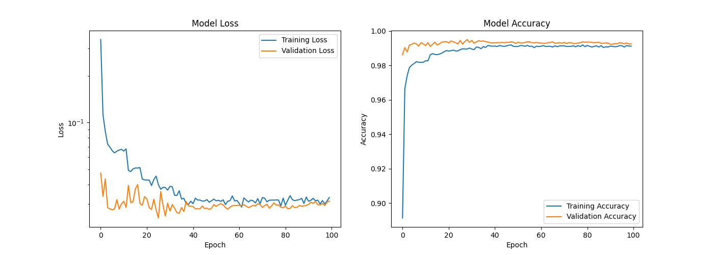

# CNN für den MNIST-Datensatz (Gruppennumer: 101)


## Kurzbeschreibung

In diesem GitLab-Projekt wollen wir gemeinsam am Code arbeiten, um das Modul Künstliche Intelligenz I im Wintersemester 2023/24 abzuschließen. Ziel des Projekts ist die Bearbeitung der folgenden Aufgabe:
>"Betrachten Sie den MNIST-Datensatz zur Handschriftenerkennung von Ziffern, wie in der Vorlesung betrachtet. Entwickeln Sie ein convolutional neural network (CNN) und vergleichen Sie Ihr Modell mit den in der Vorlesung behandelten Netzwerken."



## Datenquelle

Der MNIST-Datensatz ist eine bekannte Datenquelle in der Welt des maschinellen Lernens, die zur Handschriftenerkennung von Ziffern verwendet wird. 
>The MNIST database (Modified National Institute of Standards and Technology database) is a large collection of handwritten digits. It has a training set of 60,000 examples, and a test set of 10,000 examples. It is a subset of a larger NIST Special Database 3 (digits written by employees of the United States Census Bureau) and Special Database 1 (digits written by high school students) which contain monochrome images of handwritten digits. The digits have been size-normalized and centered in a fixed-size image. The original black and white (bilevel) images from NIST were size normalized to fit in a 20x20 pixel box while preserving their aspect ratio. The resulting images contain grey levels as a result of the anti-aliasing technique used by the normalization algorithm. the images were centered in a 28x28 image by computing the center of mass of the pixels, and translating the image so as to position this point at the center of the 28x28 field. **Quelle: [TensorFlow](https://www.tensorflow.org/datasets/catalog/mnist)**

Die Daten werden direkt über TensorFlow wie folgt abgerufen:

```python
from tensorflow.keras.datasets import mnist

def load_mnist_data():
    (train_images, train_labels), (test_images, test_labels) = mnist.load_data()
    return train_images, train_labels, test_images, test_labels
```
Die anschließende Datentransformation und -vorbereitung wird in einem späteren Abschnitt der Dokumentation eingehend betrachtet.

## Installation und Einrichtung

### GPU-Unterstützung für TensorFlow

Damit TensorFlow auch dedizierte Grafikkarten (GPUs) für Berechnungen verwendet, müssen eventuell einige Konfigurationsschritte unternommen werden. Dies kann insbesondere unter Systemen mit Windows herausfordernd sein. Es wird empfohlen, bei der offiziellen [TensorFlow-Dokumentation](https://www.tensorflow.org/install/pip) zu beginnen, um TensorFlow für die GPU-Nutzung zu konfigurieren.

### Umgebung und Abhängigkeiten

Für die Entwicklung dieses Projekts wurde eine virtuelle Umgebung mit Anaconda erstellt. Es wird empfohlen, für die Reproduzierbarkeit der Ergebnisse und zur Vermeidung von Konflikten mit anderen Projekten eine ähnliche Umgebung zu verwenden.

#### Schritt 1: Anaconda Installation
Falls noch nicht installiert, laden Sie Anaconda von der [offiziellen Seite](https://www.anaconda.com/) herunter und folgen Sie den Installationsanweisungen für Ihr Betriebssystem.

#### Schritt 2: Erstellen einer virtuellen Umgebung

Erstellen Sie eine neue virtuelle Umgebung z.B. tensorflow-gpu (oder ein anderer präferierter Name) mit Python 3.8:

```bash
$ conda create -n tensorflow-gpu python=3.8
```

Aktivieren Sie die neu erstellte Umgebung:

```bash
$ conda activate tensorflow-gpu
```

#### Schritt 3: Installation der benötigten Pakete

Folgende Packages werden für unser Modell benötigt. Die abhängigen Packages sollten automatisch durch pip isntalliert werden.

| Name                   | Version              | Build            | Channel     |
|------------------------|----------------------|------------------|-------------|
| tensorflow             | 2.5.0                | pypi_0           | pypi        |
| matplotlib             | 3.6.0                | pypi_0           | pypi        |
| scikit-learn           | 1.3.2                | pypi_0           | pypi        |

Führen Sie für die Installation den folgenden Befehl in Ihrem (Anaconda-)Terminal bei aktiviertem "tensorflow-gpu" (o.Ä.) Enviroment aus:

```bash
$ pip install tensorflow==2.5 matplotlib==3.6 scikit-learn==1.3.2
```

### Prüfen ob TensorFlow die GPU nutzt

GPUs setzen sich immer mehr als Standard für Deep Learning durch. Dank ihrer großen Anzahl an logischen Kernen ermöglichen GPUs eine weitreichende Parallelverarbeitung, was sie im Vergleich zu herkömmlichen CPUs leistungsfähiger und schneller bei der Durchführung von Berechnungen macht.

Es ist gut möglich, dass in Ihrem Computer eine dedizierte Grafikkarte eingebaut ist. Allerdings kann es vorkommen, dass diese bei der Modellberechnung mit TensorFlow nicht zum Einsatz kommt. Standardmäßig erfolgt das Training auf der CPU, falls nicht anders konfiguriert. Deshalb ist es wichtig, zu überprüfen, ob TensorFlow tatsächlich Ihre GPU nutzt, um das volle Potenzial Ihres Systems auszuschöpfen.

Wenn Sie wissen wollen, ob TensorFlow die GPU-Beschleunigung nutzt oder nicht, können Sie einfach den folgenden Pythoncode verwenden:

````python
import tensorflow as tf

tf.config.list_physical_devices('GPU')
````
Die Ausgabe sollte dann in etwa so aussehen:

```console
2024-03-13 11:26:51.441234: I tensorflow/stream_executor/platform/default/dso_loader.cc:53] Successfully opened dynamic library cudart64_110.dll
2024-03-13 11:27:06.093329: I tensorflow/stream_executor/platform/default/dso_loader.cc:53] Successfully opened dynamic library nvcuda.dll
2024-03-13 11:27:07.213670: I tensorflow/core/common_runtime/gpu/gpu_device.cc:1733] Found device 0 with properties: 
pciBusID: 0000:01:00.0 name: NVIDIA GeForce GTX 1060 with Max-Q Design computeCapability: 6.1
coreClock: 1.48GHz coreCount: 10 deviceMemorySize: 6.00GiB deviceMemoryBandwidth: 178.99GiB/s
2024-03-13 11:27:07.228018: I tensorflow/stream_executor/platform/default/dso_loader.cc:53] Successfully opened dynamic library cudart64_110.dll
2024-03-13 11:27:08.675544: I tensorflow/stream_executor/platform/default/dso_loader.cc:53] Successfully opened dynamic library cublas64_11.dll
2024-03-13 11:27:08.679613: I tensorflow/stream_executor/platform/default/dso_loader.cc:53] Successfully opened dynamic library cublasLt64_11.dll
2024-03-13 11:27:09.119743: I tensorflow/stream_executor/platform/default/dso_loader.cc:53] Successfully opened dynamic library cufft64_10.dll
2024-03-13 11:27:09.201428: I tensorflow/stream_executor/platform/default/dso_loader.cc:53] Successfully opened dynamic library curand64_10.dll
2024-03-13 11:27:09.342143: I tensorflow/stream_executor/platform/default/dso_loader.cc:53] Successfully opened dynamic library cusolver64_11.dll
2024-03-13 11:27:09.493343: I tensorflow/stream_executor/platform/default/dso_loader.cc:53] Successfully opened dynamic library cusparse64_11.dll
2024-03-13 11:27:09.563140: I tensorflow/stream_executor/platform/default/dso_loader.cc:53] Successfully opened dynamic library cudnn64_8.dll
2024-03-13 11:27:09.573457: I tensorflow/core/common_runtime/gpu/gpu_device.cc:1871] Adding visible gpu devices: 0
```

## Anleitung zur Benutzung

### Daten laden und vorverarbeiten

Die Daten werden automatisch vom MNIST-Datensatz geladen und vorverarbeitet. Dies geschieht durch Ausführung der Skripte `data_loader.py` und `data_preprocess.py`, die für das Laden der Daten und deren Vorverarbeitung zuständig sind. Diese Schritte werden intern von der `main.py` Datei verwaltet, sodass keine manuelle Intervention erforderlich ist.

### Modelltraining

Das Training des Modells wird durch das Skript `model_training.py` verwaltet. Es definiert das CNN-Modell, führt das Training durch und wendet Methoden wie Early Stopping und Learning Rate Reduction an, um die Leistung des Modells zu optimieren.

Um das Training zu starten, führen Sie einfach die `main.py`-Datei aus:

```bash
$ python main.py
```


### Modellbewertung und Ergebnisanalyse

Nach dem Training wird das Modell automatisch mit dem Testdatensatz bewertet, und die Testverlust und -genauigkeit werden angezeigt. Darüber hinaus wird der Trainingsverlauf, einschließlich Trainings- und Validierungsverlust sowie -genauigkeit, mit Hilfe von Matplotlib geplottet. Diese Visualisierung hilft Ihnen, die Leistung Ihres Modells über die Zeit zu analysieren.

## Konfigurationsmöglichkeiten

Das Projekt bietet verschiedene Konfigurationsmöglichkeiten über die `main.py`-Datei:

- `TEST_SIZE`: Legt den Anteil der Validierungsdaten fest.
- `epochs`: Die maximale Anzahl der Trainingsepochen. Das Training kann aufgrund des Early Stoppings früher beendet werden.
- `batch_size`: Die Größe der Batches während des Trainings.
- `SEED`: Der Seed für den Zufallsgenerator, der für die Datenaufteilung verwendet wird.
- `early_stopping_enabled`: Aktiviert oder deaktiviert das Early Stopping.

Diese Einstellungen können direkt in der `main.py`-Datei angepasst werden, um das Training nach Bedarf zu konfigurieren.

## Dateistruktur

Das Projekt "CNN-HANDWRITING" besteht aus den folgenden Dateien:

- `README.md`: Diese Datei. Sie enthält eine Einführung in das Projekt, Installationsanweisungen, Nutzungsinformationen und eine Beschreibung der Dateistruktur.
- `best_parameters.json`: Eine JSON-Datei, die automatisch erstellt wird, um die besten Parameter und Metriken des Trainings zu speichern. Diese Datei wird von `data_loader.py` verwendet, um bei zukünftigen Trainingsdurchläufen die besten Parameter zu laden und anzuwenden.
- `data_loader.py`: Enthält Funktionen zum Laden des MNIST-Datensatzes und zum Speichern/Laden der besten Trainingsparameter.
- `data_preprocess.py`: Beinhaltet die Vorverarbeitungslogik für die Bilddaten, einschließlich der Aufteilung in Trainings- und Validierungsdatensätze und der Normalisierung.
- `main.py`: Der Hauptskript, der den gesamten Trainingsprozess orchestriert, von Datenladung und -vorverarbeitung bis hin zum Modelltraining und der Ergebnisanalyse.
- `model_training.py`: Definiert das CNN-Modell und die Trainingsroutine, einschließlich Callbacks wie Early Stopping und Learning Rate Reduction.
- `my_plot.py`: Bietet Funktionen zum Plotten von Trainings- und Validierungsverlust sowie Genauigkeit über die Epochen.

Um das Projekt auszuführen und das Modell zu trainieren, starten Sie einfach `main.py` mit Python. Stellen Sie sicher, dass alle Abhängigkeiten gemäß den Anweisungen in "Installation und Abhängigkeiten" installiert sind.