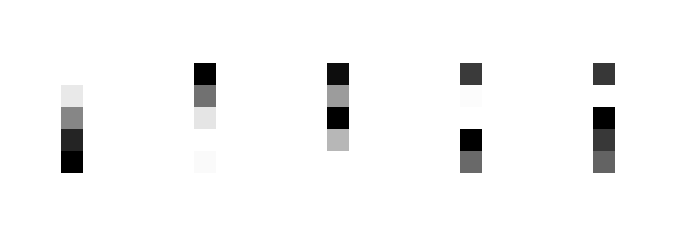

# CNN für den MNIST-Datensatz (Gruppennumer: 101)


## Kurzbeschreibung
**Autor:** *NF*

In diesem GitLab-Projekt wollen wir gemeinsam am Code arbeiten, um das Modul Künstliche Intelligenz I im Wintersemester 2023/24 abzuschließen. Ziel des Projekts ist die Bearbeitung der folgenden Aufgabe:
>"Betrachten Sie den MNIST-Datensatz zur Handschriftenerkennung von Ziffern, wie in der Vorlesung betrachtet. Entwickeln Sie ein convolutional neural network (CNN) und vergleichen Sie Ihr Modell mit den in der Vorlesung behandelten Netzwerken."


### Aktueller Trainingshighscore:
<!-- START -->
**test_loss:** 0.008994079194962978

**test_accuracy:** 0.996999979019165

**parameters:** {'angegebene epochs': 150, 'tatsaelich benoetigte epochs': 41, 'batch_size': 64, 'Split der Validierungsdaten:': 0.1, 'Seed': 2}
<!-- END -->


Der aktuelle Highscore beim Training ist auch in der `best_parameters.json` zu finden.


## Activation maps von erstem Conv
**Autor:** *MG*


## Filter
**Autor:** *MG*



## TSNE Plot
**Autor:** *MG*


## Hintergrund MNIST Datensatz

**Autor:** *KK*

Der MNIST (Modified National Institute of Standards and Technology database) Datensatz ist ein zahlenbasierter Datensatz mit knapp 70.000 Daten. Inhalt der daten sind handschriftlich geschriebene Zahlen von 0 bis 9 in 28x28 Pixel-Bildern, die auf individuelle Art und Weise aufgeschrieben worden sind.


Von diesen 70.000 Daten sind 60.000 Trainingsdaten und 10.000 Testdaten. Die 60.000 Trainingsdaten sind, wie der Name schon verrät, da um das Modell zu trainieren. Die 10.000 Bilder in den Testdaten sind dafür da, um die trainierten Daten zu vergleichen.  Ziel ist es, mit Hilfe von neuronalen Netzen die Zahlen richtig zu erkennen und zu klassifizieren.  Mithilfe von diesem freizugänglichen Datensatz können Neuronale Netze erstellt werden, dadurch das maschinelle Lernen im Allgemeinen gefördert werden. Das Training und die Evaluierung von Algorithmen für die optische Zeichenerkennung (OCR) und das maschinelle Lernen verwendet.
Auch kann man diese Daten in verschiedensten Varianten visuell aufzeigen. In den folgenden Bildern wurden die Daten in beispielsweise Cluster, PCA und t-SNE Visualisierung, da diese unserer Meinung nach die besten sind. Mit dem Cluster sollen die Daten gruppiert werden und unterschiedlich zu anderen Gruppen (Clustern) gemacht werden.


Desweiteren wurde eine Prinicpal Compotent Analysis (PCA) Darstellung erzeugt. Die PCA soll Date mit hohen bzw. vielen Dimensionen sollen damit verstädnlicher gemacht werden indem man die Dimemsionen reduziert. Dabei sollen viele Varioatienen beibehalten werden. PCA transformiert die Daten in einen neuen Merkmalsraum, der durch die Hauptkomponenten definiert wird. Diese Hauptkomponenten sind die linearen Kombinationen der ursprünglichen Merkmale, die die maximale Varianz im Datensatz erklären.


Und als letztes wurde der Datensatz mithilfe der t-Distributed Stochastic Neighbor Embedding (t-SNE) Methode visualisiert. Auch diese Methode wird genutzt, um die hochdimensionalen Räume zu vereinfachen bzw. diese zu reduzieren. Aber im Gegensatz zum PCA Prinzip, wird hier versucht die Merkmale im gleichen Datenraum beizubehalten.


**Quellen:**
- **[https://docs.ultralytics.com/de/datasets/classify/mnist](https://docs.ultralytics.com/de/datasets/classify/mnist)**
- **[https://www.tensorflow.org/datasets/catalog/mnist](https://www.tensorflow.org/datasets/catalog/mnist)**

## Laden der Daten
**Autor:** *NF*

Die Daten werden direkt über TensorFlow wie folgt abgerufen:

```python
from tensorflow.keras.datasets import mnist

def load_mnist_data():
    (train_images, train_labels), (test_images, test_labels) = mnist.load_data()
    return train_images, train_labels, test_images, test_labels
```
Die anschließende Datentransformation und -vorbereitung wird in einem späteren Abschnitt der Dokumentation eingehend betrachtet.

## Installation und Einrichtung
**Autor:** *NF*

### GPU-Unterstützung für TensorFlow

Damit TensorFlow auch dedizierte Grafikkarten (GPUs) für Berechnungen verwendet, müssen eventuell einige Konfigurationsschritte unternommen werden. Dies kann insbesondere unter Systemen mit Windows herausfordernd sein. Es wird empfohlen, bei der offiziellen [TensorFlow-Dokumentation](https://www.tensorflow.org/install/pip) zu beginnen, um TensorFlow für die GPU-Nutzung zu konfigurieren.

### Umgebung und Abhängigkeiten

Für die Entwicklung dieses Projekts wurde eine virtuelle Umgebung mit Anaconda erstellt. Es wird empfohlen, für die Reproduzierbarkeit der Ergebnisse und zur Vermeidung von Konflikten mit anderen Projekten eine ähnliche Umgebung zu verwenden.

#### Schritt 1: Anaconda Installation
Falls noch nicht installiert, laden Sie Anaconda von der [offiziellen Seite](https://www.anaconda.com/) herunter und folgen Sie den Installationsanweisungen für Ihr Betriebssystem.

#### Schritt 2: Erstellen einer virtuellen Umgebung

Erstellen Sie eine neue virtuelle Umgebung z.B. tensorflow-gpu (oder ein anderer präferierter Name) mit Python ~~3.8~~ 3.9:

```bash
$ conda create -n tensorflow-gpu python=3.9
```

Aktivieren Sie die neu erstellte Umgebung:

```bash
$ conda activate tensorflow-gpu
```

#### Schritt 3: Installation der benötigten Pakete

Folgende Packages werden für unser Modell benötigt. Die abhängigen Packages sollten automatisch durch pip installiert werden.

| Name                   | Version              |
|------------------------|----------------------|
| tensorflow             | 2.10.1               |
| matplotlib             | 3.8.3                |
| scikit-learn           | 1.4.1.post1          |
| keras                  | 2.10.0               |
| numpy                  | 1.26.4               |
| seaborn                | 0.13.2               |

Führen Sie für die Installation den folgenden Befehl in Ihrem (Anaconda-)Terminal bei aktiviertem "tensorflow-gpu" (o.Ä.) Enviroment aus:

```bash
$ pip install tensorflow==2.10.1 matplotlib==3.8.3 scikit-learn==1.4.1.post1 keras==2.10.0 numpy==1.26.4 seaborn==0.13.2
```

### Prüfen ob TensorFlow die GPU nutzt

GPUs setzen sich immer mehr als Standard für Deep Learning durch. Dank ihrer großen Anzahl an logischen Kernen ermöglichen GPUs eine weitreichende Parallelverarbeitung, was sie im Vergleich zu herkömmlichen CPUs leistungsfähiger und schneller bei der Durchführung von Berechnungen macht.

Es ist gut möglich, dass in Ihrem Computer eine dedizierte Grafikkarte eingebaut ist. Allerdings kann es vorkommen, dass diese bei der Modellberechnung mit TensorFlow nicht zum Einsatz kommt. Standardmäßig erfolgt das Training auf der CPU, falls nicht anders konfiguriert. Deshalb ist es wichtig, zu überprüfen, ob TensorFlow tatsächlich Ihre GPU nutzt, um das volle Potenzial Ihres Systems auszuschöpfen.

Wenn Sie wissen wollen, ob TensorFlow die GPU-Beschleunigung nutzt oder nicht, können Sie einfach den folgenden Pythoncode verwenden:

````python
import tensorflow as tf

tf.config.list_physical_devices('GPU')
````
Die Ausgabe sollte dann in etwa so aussehen:

```console
2024-03-13 11:26:51.441234: I tensorflow/stream_executor/platform/default/dso_loader.cc:53] Successfully opened dynamic library cudart64_110.dll
2024-03-13 11:27:06.093329: I tensorflow/stream_executor/platform/default/dso_loader.cc:53] Successfully opened dynamic library nvcuda.dll
2024-03-13 11:27:07.213670: I tensorflow/core/common_runtime/gpu/gpu_device.cc:1733] Found device 0 with properties: 
pciBusID: 0000:01:00.0 name: NVIDIA GeForce GTX 1060 with Max-Q Design computeCapability: 6.1
coreClock: 1.48GHz coreCount: 10 deviceMemorySize: 6.00GiB deviceMemoryBandwidth: 178.99GiB/s
2024-03-13 11:27:07.228018: I tensorflow/stream_executor/platform/default/dso_loader.cc:53] Successfully opened dynamic library cudart64_110.dll
2024-03-13 11:27:08.675544: I tensorflow/stream_executor/platform/default/dso_loader.cc:53] Successfully opened dynamic library cublas64_11.dll
2024-03-13 11:27:08.679613: I tensorflow/stream_executor/platform/default/dso_loader.cc:53] Successfully opened dynamic library cublasLt64_11.dll
2024-03-13 11:27:09.119743: I tensorflow/stream_executor/platform/default/dso_loader.cc:53] Successfully opened dynamic library cufft64_10.dll
2024-03-13 11:27:09.201428: I tensorflow/stream_executor/platform/default/dso_loader.cc:53] Successfully opened dynamic library curand64_10.dll
2024-03-13 11:27:09.342143: I tensorflow/stream_executor/platform/default/dso_loader.cc:53] Successfully opened dynamic library cusolver64_11.dll
2024-03-13 11:27:09.493343: I tensorflow/stream_executor/platform/default/dso_loader.cc:53] Successfully opened dynamic library cusparse64_11.dll
2024-03-13 11:27:09.563140: I tensorflow/stream_executor/platform/default/dso_loader.cc:53] Successfully opened dynamic library cudnn64_8.dll
2024-03-13 11:27:09.573457: I tensorflow/core/common_runtime/gpu/gpu_device.cc:1871] Adding visible gpu devices: 0
```

## Anleitung zur Benutzung
**Autor:** *NF*
### Daten laden und vorverarbeiten

Die Daten werden automatisch vom MNIST-Datensatz geladen und vorverarbeitet. Dies geschieht durch Ausführung der Skripte `_01_data_loader.py` und `_02_data_preprocess.py`, die für das Laden der Daten und deren Vorverarbeitung zuständig sind. Diese Schritte werden intern von der `_00_main.py` Datei verwaltet, sodass keine manuelle Intervention erforderlich ist.

### Modelltraining

Das Training des Modells wird durch das Skript `_03_model_training.py` verwaltet. Es definiert das CNN-Modell, führt das Training durch und wendet Methoden wie Early Stopping und Learning Rate Reduction an, um die Leistung des Modells zu optimieren.

Um das Training zu starten, führen Sie einfach die `_00_main.py`-Datei aus:

```bash
$ python _00_main.py
```


## Ergebnisse der CNN-Entwicklung für den MNIST-Datensatz
**Autor:** *NF*

Im Rahmen des Moduls Künstliche Intelligenz I stellten wir uns der Herausforderung ein Convolutional Neural Network (CNN) für die Handschriftenerkennung auf Basis des MNIST-Datensatzes zu entwickeln. Ziel war es, ein Modell zu entwerfen, das nicht nur präzise Vorhersagen trifft, sondern auch im Vergleich zu den in der Vorlesung behandelten Netzwerken überlegen ist.

Dabei haben wir für unser Modell bei unserem zweiten Gruppentreffen das gemeinsame Ziel wie folgt spezifiziert:

>Das CNN soll eine **Genauigkeit** von über 99,5 % auf den Testdatensatz erreichen, bei gleichzeitiger **Vermeidung von Overfitting** und ohne erheblichen **Rechenaufwand**. 

Nach dem Training wird das Modell automatisch mit dem Testdatensatz bewertet, und die Testverlust und -genauigkeit werden angezeigt. Darüber hinaus wird der Trainingsverlauf, einschließlich Trainings- und Validierungsverlust sowie -genauigkeit, mit Hilfe von Matplotlib geplottet. Diese Visualisierung hilft, die Leistung des Modells über die Zeit zu analysieren.

### Modellarchitektur

#### Modelle der Vorlesung
 Ausgangspunkt für die Architektur unseres CNN waren dabei die in der Vorlesung vorgestellten vier Modelle welche jeweils eine Genauigkeit auf den Testdatensatz zwischen 98,95 % und 99,27 % erreichten:
 
 | Name                   | Loss          | Accuracy         |
 |------------------------|---------------|------------------|
 | model_simple_conv      | 0,1163        | 0,9895           |
 | model_drop_conv        | 0,0359        | 0,9921           |
 | model_drop_move_conv   | 0,0293        | 0,9921           |
 | model_drop_full_conv   | 0,0250        | 0,9927           |

Das erste Modell in der Reihe ist ein einfaches CNN, welches aus einer *Convolutional Layer*, einer *MaxPooling Layer* zur Reduzierung der Dimensionalität, einer *Flatten Layer* zur Umwandlung der 2D-Ausgaben in einen Vektor, gefolgt von einer *Dense Layer* für die Klassifizierung und einer *Output Layer* mit *Softmax-Aktivierung*.

Das zweite Modell baut auf dem ersten auf, indem es eine *Dropout-Layer* einführt, um das Overfitting zu reduzieren. Durch das zufällige Deaktivieren von Neuronen während des Trainings wird eine robustere und generalisierbare Modellstruktur geschaffen. Diese zusätzliche Regularisierungsschicht soll die Modellperformance auf unbekannten Daten verbessern, indem sie eine bessere Generalisierung fördert.

Das dritte Modell erweitert das Konzept weiter durch Einführung von *Data Augmentation*. Zusätzlich zur Dropout-Layer wird das Modell mit einem Datensatz trainiert, der durch das Verschieben der ursprünglichen Bilder in verschiedene Richtungen vergrößert wurde. Diese Technik zielt darauf ab, die Robustheit des Modells gegenüber Verschiebungen und Veränderungen in den Eingabedaten zu erhöhen, indem es lernt, wichtige Merkmale unabhängig von ihrer Position im Bild zu erkennen.

Schließlich integriert das vierte Modell neben der Dropout-Regulierung und den Verschiebungen auch Rotationen in die Data Augmentation, um das Trainingsspektrum noch weiter zu erweitern. Dabei werden die Bilder zufällig zwischen -30° und +30° gedreht. Diese Kombination von Techniken zielt darauf ab, das CNN noch flexibler und widerstandsfähiger gegenüber einer Vielzahl von Bildvariationen zu machen. Durch das Training mit einem so diversifizierten Datensatz strebt das vierte Modell die höchste Generalisierungsfähigkeit und Leistung unter den vier Ansätzen an.

#### Unser Modell (Stand 27.03.2024)
Unser Modell besteht aus mehreren *Convolutional* (*Conv2D*) und *MaxPooling2D*-Schichten, gefolgt von *Dropout*-Schichten, einer *Flatten*-Schicht und mehreren *Dense*-Schichten, die in eine *Softmax*-Aktivierungsfunktion münden.

Die Architektur beginnt mit *Conv2D*-Schichten, die die Grundlage der Feature-Extraktion bilden. Diese Schichten wenden Filter auf die Eingabebilder an, um Merkmale wie Kanten, Ecken und Texturen zu identifizieren. Die Nutzung von 5x5-Filtern gefolgt von 3x3-Filtern ermöglicht es dem Netzwerk, zunächst breitere Muster zu erkennen und daraufhin detailliertere, feinere Strukturen zu erfassen.

Um den Lernprozess weiter zu optimieren und zu stabilisieren, folgt auf jede *Conv2D*-Schicht eine *BatchNormalization*. Wir haben durch Experimentieren festgestellt, dass durch die *BatchNormalization* nach jedem Schritt, dass Modell schneller während des Trainings konvergiert und weniger empfindlich auf kleine Schwankungen in den Trainingsdaten reagiert. Das Resultat ist eine Reduzierung des *Overfittings*.

Zur Reduktion der Komplexität und weiteren Vermeidung von Overfitting tragen *MaxPooling2D*-Schichten bei. Sie verringern die räumlichen Dimensionen der Feature-Maps, wodurch die Anzahl der Parameter reduziert und die Rechenanforderungen gesenkt werden. Diese Verringerung zwingt das Netzwerk, sich auf die wesentlichsten Merkmale zu konzentrieren, was die Generalisierungsfähigkeit des Modells verbessert.

Ein weiterer wichtiger Aspekt der Architektur ist die Integration von *Dropout* als Regularisierungstechnik. Durch das zufällige Nullsetzen von Neuronenausgaben während des Trainings wird eine zu starke Abhängigkeit von den Trainingsdaten vermieden. Diese Methode fördert eine robuste Feature-Erkennung, die auf neuen, unbekannten Daten gut generalisiert.
Schließlich wird die Architektur durch *Flatten*- und *Dense*-Schichten vervollständigt, die die extrahierten und verarbeiteten Merkmale in Klassifikationswahrscheinlichkeiten umwandeln. Die *Flatten*-Schicht konvertiert die *2D-Feature-Maps* in einen eindimensionalen Vektor, der von den *Dense*-Schichten verarbeitet wird. Die letzte Schicht nutzt die *Softmax-Funktion*, um die Zugehörigkeit eines Bildes zu einer der 10 Ziffernklassen in Form von Wahrscheinlichkeiten auszudrücken.

### Daten Augumentation

Für die Erweiterung des Trainingsdatensatzes verwenden wir den Keras ImageDataGenerator. 

In der für uns am sinnvollsten erscheinenden Konfigurationen **rotieren** wir wie bereits in der Vorlesung die Bilder zufällig um den Bildmittelpunkt. Dabei haben wir aber den Bereich der Rotation auf -10° bis +10° beschränkt. Diese Transformation bereitet das Modell darauf vor, Objekte unabhängig von ihrer Ausrichtung korrekt zu identifizieren, was die Fähigkeit des Modells verbessert, mit Drehungen in Eingabebildern umzugehen.

Außerdem **vergrößern oder verkleinern** wir die Bilder um bis zu 10%. Diese Skalierung hilft dem Modell, Objekte unterschiedlicher Größe zu erkennen und damit flexibler auf Variationen in der Bildskalierung zu reagieren.

Die **Breiten- und Höhenverschiebung** ermöglicht es, die Bilder horizontal und vertikal um bis zu 10% zu verschieben. Durch diese Verschiebungen lernt das Modell, wichtige Merkmale und Objekte im Bild zu erkennen, selbst wenn sie nicht zentral positioniert sind.
Durch die Vielfalt der generierten Datenbilder wird das Modell robuster und weniger anfällig für Overfitting, was seine Generalisierungsfähigkeit auf unbekannte Daten, bzw. den Testdatensatz signifikant verbessert.

### Optimizer und Training

Für die Optimierung des Trainingsprozesses entdeckten wir zwei besondere Methoden: die dynamische Anpassung der Lernrate (*ReduceLROnPlateau*)  und die frühzeitige Beendigung des Trainings (*EarlyStopping*). Diese so genannten Callbacks halfen dabei, die Leistung unseres Modells fein zu justieren und Overfitting zu verhindern, indem sie einen Parameter beobachten und die Lernrate verkleinern oder den Trainingsprozess beenden sofern der beobachtete Parameter über einen festgelegten Zeitraum keine signifikante Veränderung mehr aufzeigt.


Bei der Visualierung der Metriken *Loss* und *Accuracy* unseres Modells 
ist zu Erkennen, dass Trainings- und Validierungsdaten ungefähr bei Epoche 21 konvergieren. Ab dieser Epoche ist die Accuracy des Trainingsset größer als die des Validierungsdatensatzes, bzw. der Loss des Traingssets geringer, als der des Validierungssets. Zur Vermeidung von Overfitting, sollte das Training ca. bei Epoche 21 beendet werden.

### Erreichte Ergebnisse

Unser CNN hat beeindruckende Ergebnisse erzielt. Mit einem Testverlust von nur `0.009` und einer Testgenauigkeit von `0.997` übertrifft unser Modell die Leistung der in der Vorlesung vorgestellten Netzwerke deutlich. Diese Ergebnisse verdeutlichen die Effektivität unserer Modellarchitektur und des Trainingsansatzes, die zusammen ein hohes Maß an Präzision und Zuverlässigkeit bei der Handschriftenerkennung ermöglichen.

| Name                   | Loss          | Accuracy         |
|------------------------|---------------|------------------|
| CNN-MNIST-101          | 0,0090        | 0,9970           |

### Bedeutung der Ergebnisse

Die erzielte Testgenauigkeit von 99,7% stellt einen signifikanten Fortschritt in der Genauigkeit der Handschriftenerkennung gegenüber den in Vorlesung vorgestellten Modellen dar und bestätigt die Fähigkeit unseres CNNs, selbst subtile Unterschiede zwischen verschiedenen Ziffern zu erkennen und korrekt zu klassifizieren.

Zudem zeigt der niedrige Testverlust, dass unser Modell sehr präzeise Vorhersagen trifft.

Nach der Anwendung unseres Modell auf den Testdatensatz (10 000 Bilder) zeigt die folgende Konfusionsmatrix, wie die Ziffern durch das Modell identifiziert wurden.


Wir sehen, dass unser Modell insbesondere bei der Identifizierung der Ziffern `5`und `9` Probleme hat. Diese werden jeweils vier mal fälschlciherweise als `3` bzw. als `4` identifiziert.

Die folgende Grafik zeigt uns die falsch identifizierten Bilder, absteigend sortiert nach der Differenz der:
- **Vorhergesagten Wahrscheinlichkeit**, die vom Modell als am wahrscheinlichsten erachteten Labels und der
- **Wahren Wahrscheinlichkeit**, die aus dem Modell für das tatsächlich richtige Label extrahiert wird, basierend auf der Vorhersagewahrscheinlichkeit des Modells für dieses richtige Label.


Diese Differenz zeigt, wie groß der Unterschied zwischen der Zuversicht des Modells in seiner Wahl (die höchste Wahrscheinlichkeit, die es einem Label zuordnet) und der Zuversicht, die es eigentlich in die richtige Antwort haben sollte, ist. Wenn der Wert groß ist, bedeutet das, dass das Modell sehr sicher in einer falschen Vorhersage war – es hat ein falsches Label mit hoher Wahrscheinlichkeit vorhergesagt und dabei die richtige Antwort nicht ähnlich hoch bewertet. Also, anstatt direkt anzugeben, wie „sicher“ das Modell bei einer korrekten Identifizierung ist, zeigt dieser Wert, wie fehlgeleitet die Sicherheit des Modells bei einem Fehler war.

### Abschließende Gedanken

Wir sind stolz auf die Leistung unseres CNNs und die Fortschritte, die wir im Vergleich zu bestehenden Modellen gemacht haben. Diese Ergebnisse sind nicht nur ein Beleg für die erfolgreiche Umsetzung des Konzepte aus der Vorlesung in die Praxis, sondern auch ein motivierender Schritt vorwärts in unserer kontinuierlichen Entwicklung im Bereich des maschinellen Lernens.

Ein interessanter Aspekt für zukünftige Untersuchungen könnte die Validierung unseres Modells auf anderen Datensätzen sein, insbesondere solchen, die aus verschiedenen kulturellen Kontexten stammen. Zum Beispiel könnte ein Datensatz mit deutscher Handschrift untersucht werden, da es kulturelle Unterschiede in der handschriftlichen Schreibweise von Ziffern gibt. Der MNIST-Datensatz basiert auf amerikanischen Handschriften, was bedeutet, dass unser Modell auf Datensätzen aus anderen Ländern möglicherweise unterschiedlich abschneiden könnte. Die Überprüfung der Robustheit und Generalisierbarkeit unseres CNNs über den MNIST-Datensatz hinaus könnte uns wertvolle Einblicke in seine Anwendbarkeit auf eine breitere Palette von Handschriftenerkennungsaufgaben geben.

Anschließend könnte ein Ensemble-Modell, welches mehrere CNNs zu einem Modell verknüpft, entwickelt werden, wodurch sich die Modellgenauigkeit weiter steigern ließe. Ein weiterer reizvoller Schritt, wäre das Modell auf einen mit einer Kamera versehenen Mikrocontroller (z.B. ESP32 mit OV240 camera) zu flashen um davon ausgehend die Funktionalität unseres Modells in der Realität zu testen.


## Konfigurationsmöglichkeiten
**Autor:** *NF*

Das Projekt bietet verschiedene Konfigurationsmöglichkeiten über die `_00_main.py`-Datei:

- `VAL_SIZE`: Legt den relativen Anteil der Validierungsdaten fest (zwischen 0 und 1). Empfohlen wird ein Split von `0.1`.
- `epochs`: Die maximale Anzahl der Trainingsepochen. Das Training kann aufgrund des Early Stoppings früher beendet werden. Empfohlen wird ein Wert <`40`.
- `batch_size`: Die Größe der Batches während des Trainings. Empfohlen wird eine Größe von `64`.
- `SEED`: Der Seed für den Zufallsgenerator, der für die Datenaufteilung verwendet wird. Bei der gemeinsamen Arbeit an unserem Modell nutzten wir den Seed `2`.
- `early_stopping_enabled`: Aktiviert oder deaktiviert das Early Stopping (`True`oder `False`).

Diese Einstellungen können direkt in der `_00_main.py`-Datei angepasst werden, um das Training nach Bedarf zu konfigurieren. Die Einstellungen die den aktuellen "Modell-Highscore" erzielten werden automatisch in der `best_parameters.json` gespeichert, aus der sie sich problemlos ablesen lassen.

## Dateistruktur
**Autor:** *NF*

Das Projekt "CNN-HANDWRITING" besteht aus den folgenden Dateien:

- `README.md`: Diese Datei. Sie enthält eine Einführung in das Projekt, Installationsanweisungen, Nutzungsinformationen und eine Beschreibung der Dateistruktur sowie der Ergebnisse.
- `best_parameters.json`: Eine JSON-Datei, die automatisch erstellt wird, um die besten Parameter und Metriken des Trainings zu speichern.
- `_00_main.py`: Der Hauptskript, der den gesamten Trainingsprozess orchestriert, von Datenladung und -vorverarbeitung bis hin zum Modelltraining und der Ergebnisanalyse.
- `_01_data_loader.py`: Enthält Funktionen zum Laden des MNIST-Datensatzes und zum Speichern/Laden der besten Trainingsparameter.
- `_02_data_preprocess.py`: Beinhaltet die Vorverarbeitungslogik für die Bilddaten, einschließlich der Aufteilung in Trainings- und Validierungsdatensätze und der Normalisierung.
- `_03_model_training.py`: Definiert das CNN-Modell und die Trainingsroutine, einschließlich Callbacks wie Early Stopping und Learning Rate Reduction.
- `_04_data_saver.py`: Zuständig für das Speichern und Übertragen der Trainingsparameter und des Modells nach einem Training mit einem neuen Highscore bei Accuracy und Loss des CNN.
- `_05_model_plot.py`: Bietet Funktionen zum Plotten von Trainings- und Validierungsverlust sowie Genauigkeit über die Epochen.

Um das Projekt auszuführen und das Modell zu trainieren, starten Sie einfach `_00_main.py` mit Python. Stellen Sie sicher, dass alle Abhängigkeiten gemäß den Anweisungen in "Installation und Abhängigkeiten" installiert sind.

## Ausblick/To-Do
**Autor:** *NF*
 - Ensemble Learning